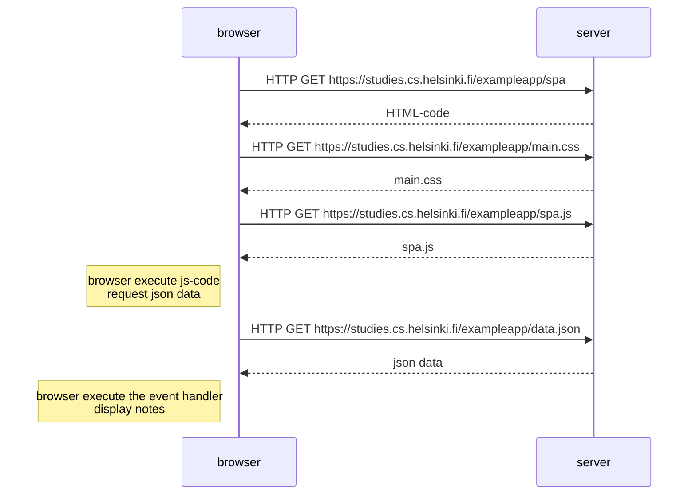

```mermaid
sequenceDiagram
    participant b as browser
    participant s as server
    b->>s: HTTP GET https://studies.cs.helsinki.fi/exampleapp/spa
    s-->>b: HTML-code
    b->>s: HTTP GET https://studies.cs.helsinki.fi/exampleapp/main.css
    s-->>b: main.css
    b->>s: HTTP GET https://studies.cs.helsinki.fi/exampleapp/spa.js
    s-->>b: spa.js
    note left of b: browser execute js-code<br/>request json data
    b->>s: HTTP GET https://studies.cs.helsinki.fi/exampleapp/data.json
    s-->>b: json data
    note left of b: browser execute the event handler<br/>display notes
```