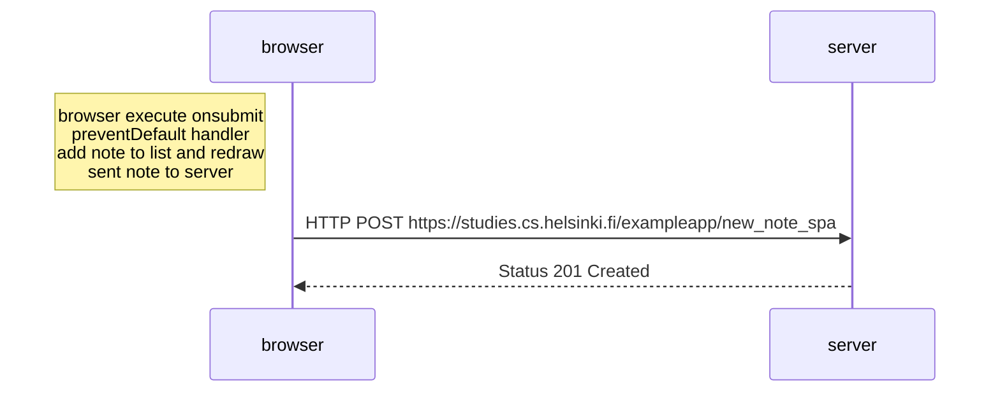

```mermaid
sequenceDiagram
    participant b as browser
    participant s as server
    note left of b: browser execute onsubmit<br/>preventDefault handler<br/>add note to list and redraw<br/>sent note to server
    b->>s: HTTP POST https://studies.cs.helsinki.fi/exampleapp/new_note_spa
    s-->>b: Status 201 Created
```